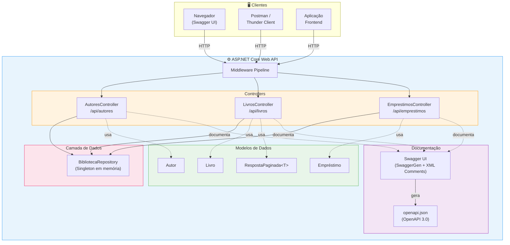

# Diagrama 1 - Arquitetura Geral da API

Cole o código Mermaid abaixo em https://mermaid.live para visualizar.

```mermaid
graph TB
    subgraph Cliente["🖥️ Clientes"]
        Browser["Navegador<br/>(Swagger UI)"]
        Postman["Postman /<br/>Thunder Client"]
        Frontend["Aplicação<br/>Frontend"]
    end

    subgraph API["⚙️ ASP.NET Core Web API"]
        MW["Middleware Pipeline"]
        
        subgraph Controllers["Controllers"]
            AC["AutoresController<br/>/api/autores"]
            LC["LivrosController<br/>/api/livros"]
            EC["EmprestimosController<br/>/api/emprestimos"]
        end

        subgraph Models["Modelos de Dados"]
            MA["Autor"]
            ML["Livro"]
            ME["Empréstimo"]
            MR["RespostaPaginada&lt;T&gt;"]
        end

        subgraph Data["Camada de Dados"]
            Repo["BibliotecaRepository<br/>(Singleton em memória)"]
        end

        subgraph Docs["Documentação"]
            Swagger["Swagger UI<br/>(SwaggerGen + XML Comments)"]
            OpenAPI["openapi.json<br/>(OpenAPI 3.0)"]
        end
    end

    Browser -->|HTTP| MW
    Postman -->|HTTP| MW
    Frontend -->|HTTP| MW

    MW --> AC
    MW --> LC
    MW --> EC

    AC --> Repo
    LC --> Repo
    EC --> Repo

    AC -.->|usa| MA
    LC -.->|usa| ML
    LC -.->|usa| MR
    EC -.->|usa| ME

    Swagger -->|gera| OpenAPI
    AC -.->|documenta| Swagger
    LC -.->|documenta| Swagger
    EC -.->|documenta| Swagger

    style API fill:#e8f4fd,stroke:#2196F3
    style Controllers fill:#fff3e0,stroke:#FF9800
    style Models fill:#e8f5e9,stroke:#4CAF50
    style Data fill:#fce4ec,stroke:#E91E63
    style Docs fill:#f3e5f5,stroke:#9C27B0
```
