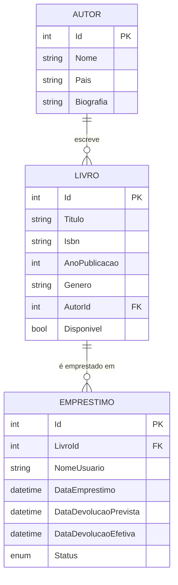

# Diagrama 2 - Modelo de Dados (Entidade-Relacionamento)

Cole o código Mermaid abaixo em https://mermaid.live para visualizar.

```mermaid
erDiagram
    AUTOR {
        int Id PK
        string Nome
        string Pais
        string Biografia
    }

    LIVRO {
        int Id PK
        string Titulo
        string Isbn
        int AnoPublicacao
        string Genero
        int AutorId FK
        bool Disponivel
    }

    EMPRESTIMO {
        int Id PK
        int LivroId FK
        string NomeUsuario
        datetime DataEmprestimo
        datetime DataDevolucaoPrevista
        datetime DataDevolucaoEfetiva
        enum Status
    }

    AUTOR ||--o{ LIVRO : "escreve"
    LIVRO ||--o{ EMPRESTIMO : "é emprestado em"
```
