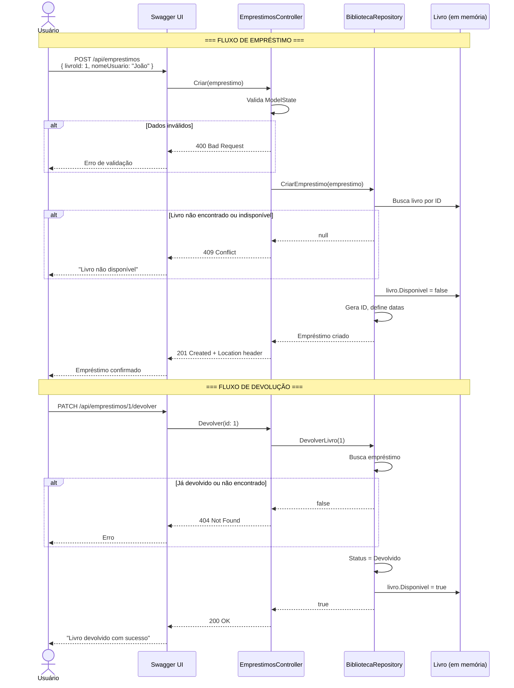

# Diagrama 3 - Fluxo de Empréstimo e Devolução

Cole o código Mermaid abaixo em https://mermaid.live para visualizar.

```mermaid
sequenceDiagram
    actor U as Usuário
    participant S as Swagger UI
    participant EC as EmprestimosController
    participant R as BibliotecaRepository
    participant L as Livro (em memória)

    Note over U,L: === FLUXO DE EMPRÉSTIMO ===

    U->>S: POST /api/emprestimos<br/>{ livroId: 1, nomeUsuario: "João" }
    S->>EC: Criar(emprestimo)
    EC->>EC: Valida ModelState

    alt Dados inválidos
        EC-->>S: 400 Bad Request
        S-->>U: Erro de validação
    end

    EC->>R: CriarEmprestimo(emprestimo)
    R->>L: Busca livro por ID
    
    alt Livro não encontrado ou indisponível
        R-->>EC: null
        EC-->>S: 409 Conflict
        S-->>U: "Livro não disponível"
    end

    R->>L: livro.Disponivel = false
    R->>R: Gera ID, define datas
    R-->>EC: Empréstimo criado
    EC-->>S: 201 Created + Location header
    S-->>U: Empréstimo confirmado

    Note over U,L: === FLUXO DE DEVOLUÇÃO ===

    U->>S: PATCH /api/emprestimos/1/devolver
    S->>EC: Devolver(id: 1)
    EC->>R: DevolverLivro(1)
    R->>R: Busca empréstimo
    
    alt Já devolvido ou não encontrado
        R-->>EC: false
        EC-->>S: 404 Not Found
        S-->>U: Erro
    end

    R->>R: Status = Devolvido
    R->>L: livro.Disponivel = true
    R-->>EC: true
    EC-->>S: 200 OK
    S-->>U: "Livro devolvido com sucesso"
```
