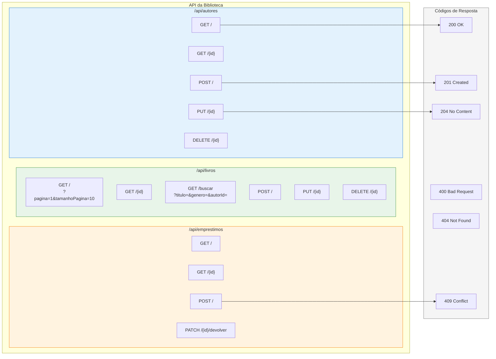

# Diagrama 4 - Mapa de Endpoints REST

Cole o código Mermaid abaixo em https://mermaid.live para visualizar.

```mermaid
graph LR
    subgraph API["API da Biblioteca"]
        direction TB

        subgraph Autores["/api/autores"]
            A1["GET /"]
            A2["GET /{id}"]
            A3["POST /"]
            A4["PUT /{id}"]
            A5["DELETE /{id}"]
        end

        subgraph Livros["/api/livros"]
            L1["GET /<br/>?pagina=1&tamanhoPagina=10"]
            L2["GET /{id}"]
            L3["GET /buscar<br/>?titulo=&genero=&autorId="]
            L4["POST /"]
            L5["PUT /{id}"]
            L6["DELETE /{id}"]
        end

        subgraph Emprestimos["/api/emprestimos"]
            E1["GET /"]
            E2["GET /{id}"]
            E3["POST /"]
            E4["PATCH /{id}/devolver"]
        end
    end

    subgraph Respostas["Códigos de Resposta"]
        R200["200 OK"]
        R201["201 Created"]
        R204["204 No Content"]
        R400["400 Bad Request"]
        R404["404 Not Found"]
        R409["409 Conflict"]
    end

    A1 --> R200
    A3 --> R201
    A4 --> R204
    E3 --> R409

    style Autores fill:#e3f2fd,stroke:#1976D2
    style Livros fill:#e8f5e9,stroke:#388E3C
    style Emprestimos fill:#fff3e0,stroke:#F57C00
    style Respostas fill:#f5f5f5,stroke:#757575
```
