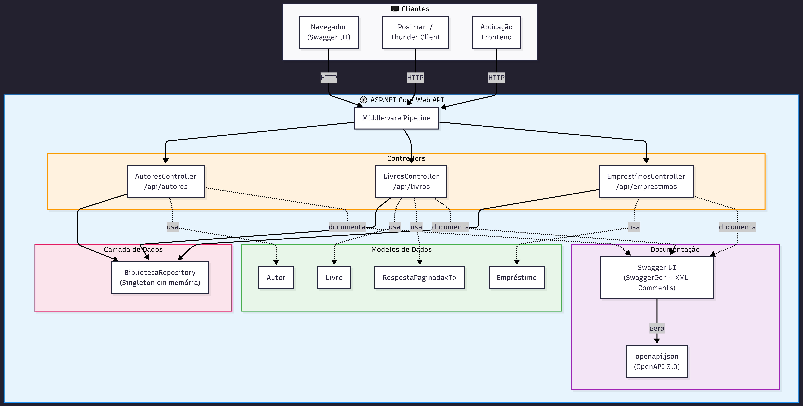
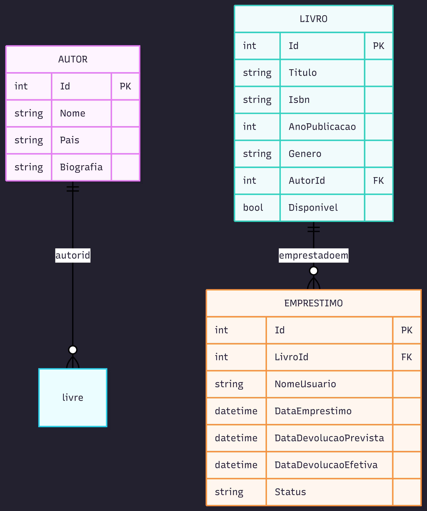
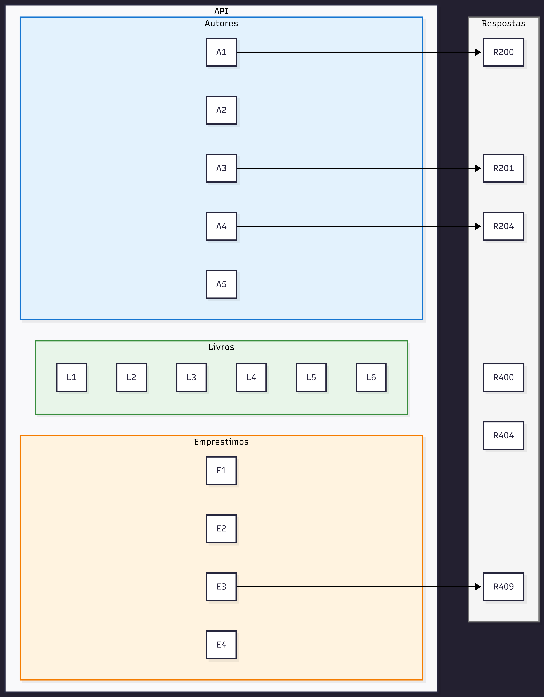

#  API da Biblioteca

API REST desenvolvida em ASP.NET Core para gerenciamento de uma biblioteca, com autores, livros e empréstimos, com documentação via Swagger.

---

## Tecnologias

* ASP.NET Core
* C#
* Swagger (OpenAPI)

---

##  Funcionalidades

* Cadastro, consulta, atualização e remoção de autores
* Cadastro e gerenciamento de livros
* Controle de empréstimos e devoluções
* Paginação e filtros de busca

---

##  Execução do projeto

```bash
dotnet run
```

A API estará disponível em:

```
http://localhost:5102/swagger
```

---

# QUESTIONÁRIO DA DOCUMENTAÇÃO:

# 1. Conhecendo a API

## 1.1 Mapeamento dos Endpoints

###  Autores

| Método | Rota              | Descrição      | Parâmetros |
| ------ | ----------------- | -------------- | ---------- |
| GET    | /api/autores      | Lista autores  | Nenhum     |
| GET    | /api/autores/{id} | Busca por ID   | id         |
| POST   | /api/autores      | Cria autor     | Body       |
| PUT    | /api/autores/{id} | Atualiza autor | id + Body  |
| DELETE | /api/autores/{id} | Remove autor   | id         |

---

###  Livros

| Método | Rota               | Descrição       | Parâmetros              |
| ------ | ------------------ | --------------- | ----------------------- |
| GET    | /api/livros        | Lista livros    | pagina, tamanhoPagina   |
| GET    | /api/livros/{id}   | Busca por ID    | id                      |
| GET    | /api/livros/buscar | Filtro de busca | titulo, genero, autorId |
| POST   | /api/livros        | Cria livro      | Body                    |
| PUT    | /api/livros/{id}   | Atualiza livro  | id + Body               |
| DELETE | /api/livros/{id}   | Remove livro    | id                      |

---

###  Empréstimos

| Método | Rota                           | Descrição          | Parâmetros |
| ------ | ------------------------------ | ------------------ | ---------- |
| GET    | /api/emprestimos               | Lista empréstimos  | Nenhum     |
| GET    | /api/emprestimos/{id}          | Busca por ID       | id         |
| POST   | /api/emprestimos               | Cria empréstimo    | Body       |
| PATCH  | /api/emprestimos/{id}/devolver | Registra devolução | id         |

---

## 1.2 Modelos de Dados

### Autor

* Nome (obrigatório)
* País
* Biografia
* Relação: um autor pode possuir vários livros (1:N)

### Livro

* Título (obrigatório)
* Ano de publicação (1000–2100)
* AutorId (obrigatório)
* Gênero
* Disponibilidade
* Relação: livro pode possuir vários empréstimos (1:N)

### Empréstimo

* LivroId (obrigatório)
* Nome do usuário (obrigatório)
* Datas de empréstimo e devolução
* Status (Ativo, Devolvido, Atrasado)

---

## 1.3 Códigos de resposta HTTP

* 200 OK → sucesso na requisição
* 201 Created → recurso criado
* 204 No Content → atualização/exclusão realizada
* 400 Bad Request → erro de validação
* 404 Not Found → recurso não encontrado
* 409 Conflict → conflito de estado (ex: livro já emprestado)

---

# ⚙️ 2. Swagger / OpenAPI

## Registro dos serviços

```csharp
builder.Services.AddEndpointsApiExplorer();
builder.Services.AddSwaggerGen();
```

* AddEndpointsApiExplorer: habilita descoberta dos endpoints
* AddSwaggerGen: gera documentação OpenAPI

---

## Middlewares

```csharp
app.UseSwagger();
app.UseSwaggerUI();
```

* UseSwagger: expõe o JSON da API
* UseSwaggerUI: ativa interface visual

---

## Teste da API

Pelo Swagger -Acesse:

http://localhost:5102/swagger

Depois:
Clique em GET /api/Autores
Clique em Try it out
Clique em Execute

Pelo navegador (direto na API):
http://localhost:5102/api/autores

---

# 📊 3. Diagramas do sistema

## Arquitetura geral



## Modelo de dados



## Fluxo de empréstimo


## Endpoints REST




---

